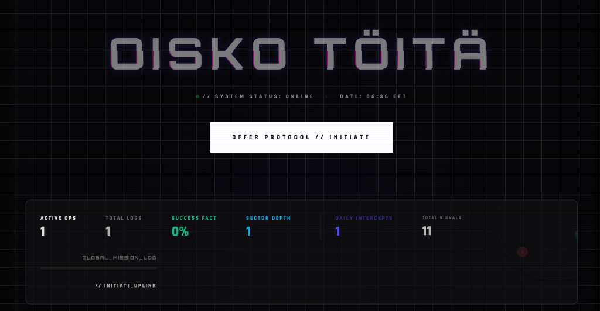
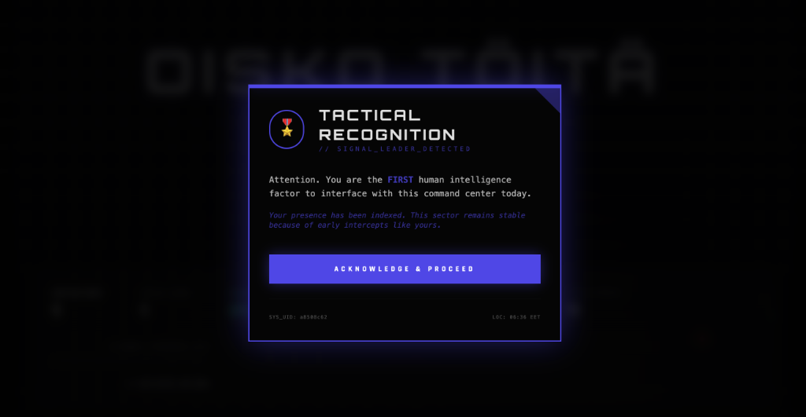
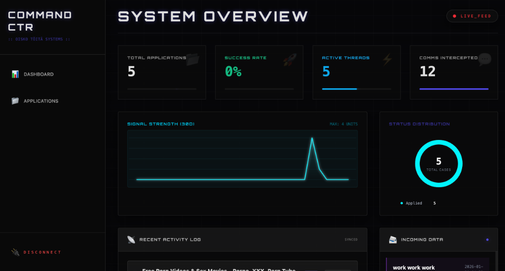

# Oisko töitä (Blazingly Fast 🚀)

**Oisko töitä** is a project created for the Job Hunter of 2026. It allows you to host your entire job search history and publicly showcase your applications, inviting the world to witness and scrutinize your process—offering undeniable proof of your performance and dedication.

## 🛰 Tactical Overview

- **Frontend**: [Dioxus](https://dioxuslabs.com/) (Rust WASM) with Vanilla CSS/Tailwind.
- **Backend**: [Axum](https://github.com/tokio-rs/axum) (Rust) with [SQLx](https://github.com/launchbadge/sqlx) & PostgreSQL.
- **Aesthetic**: "Command Center Noir" – featuring glassmorphism, pulsing glows, and terminal-grade typography.

## 🛠 Active Features

### 1. Central Command Dashboard
- **Mission Statistics**: Real-time calculation of *Active Ops*, *Success Factor*, and *Sector Depth* from live database queries.
- **Tri-Mode OS (Theming)**: Seamless switching between **Tactical Noir** (Dark), **Pristine Light** (Light), and **Bamboo Zen** (Organic) aesthetics with persistent memory.
- **Daily Signal Intercepts**: Real-time visitor tracking and analytics displayed on the main console.

### 2. Scalable Mission Log (Public Interface)
- **High-Performance Search**: Instant client-side search across company names and roles.
- **Status Filter Arrays**: Real-time filtering by application state (Applied, Interviewing, Offer, etc.).
- **Progressive Reveal**: "Reveal More Logs" pagination system designed for 500+ application scale.
- **Comms Channel (SSE)**: Real-time guest commenting system powered by Server-Sent Events for instant feedback.

### 3. Overhauled Admin Suite
- **Mission Control**: Fully restyled admin dashboard featuring glassmorphism and indigo accents.
- **Tactical Kanban Board**: Premium board view for managing application states with hover-glow dossiers.
- **Intelligence Input**: Streamlined "SCAN WEB" utility that automatically extracts company data from URLs.
- **Document Depot**: Secure multi-part upload system for CVs and cover letters.

---

## 💻 Tech Stack Depth

- **Backend**: Axum, SQLx (PostgreSQL), Tokio (SSE/Broadcast), Argon2.
- **Frontend**: Dioxus 0.7+, Rust-WASM, HTML/CSS/Tailwind.
- **Infrastructure**: Automated migrations, Secure multi-part file handling.

---

## ⚡️ Initialization (Local Dev)

For detailed local development instructions, see the **[Setup Guide](SETUP_GUIDE.md)**.

## 🛳 Deployment Prep

To launch the Command Center in a live sector:

1. **Backend**:
   - Set `DATABASE_URL` in your environment.
   - Run `cargo run --release`.
   - Ensure port `3000` is exposed.

2. **Frontend**:
   - Set `API_URL` environment variable to your backend domain (e.g., `https://api.yourdomain.com`).
   - Build for production: `dx build --release`.
   - Deploy the generated `dist` folder to your CDN or web server.

---

## 📄 License

This project is licensed under the MIT License - see the [LICENSE](LICENSE) file for details.